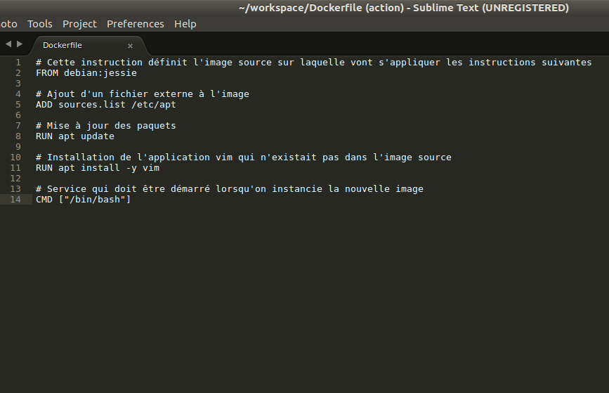

# Rapport de Stage

Le stage effectué les deux derniers mois s'est déroulé au sein du Ministère de l'Intérieur, dans l'immeuble Lumière situé au cœur du douzième arrondissement de Paris. Ce lieu, non loin de Bercy Village, est un endroit où il est agréable de se rendre chaque matin. L'édifice, composé de huit étages et de quatre sous-sols, est un des plus grands immeubles de bureaux de Paris. Ses ascenseurs panoramiques aux allures futuristes et ses escalators de part et d'autre font rêver au premier coup d’œil. 
  
A mon arrivée, j'ai retrouvé mon tuteur qui m'a tout d'abord montré mon bureau ainsi que mes nouveaux collègues. Comme vous pouvez le voir sur l'organigramme, je faisais parti du BCA, le Bureau de la Conception Applicative, lui-même se trouvant dans la Sous-Direction des Applications. 

La SDA (Sous-direction des Applications) est en charge :
* du pilotage des projets applicatifs jusqu’à la vérification du service régulier (assistance à maîtrise d'ouvrage, étude et estimation des solutions techniques, conception, développement, tests et intégration)
* du pilotage des moyens opérationnels affectés aux projets (budget des projets, préparation et suivi des marchés)
* de la maintenance ''projet'' (corrective ou adaptative, évolutive en appliquant le processus projet)

Cette entité comprend environ cent trente agents, répartis en cinq bureaux :
* Bureau du Pilotage Applications (BPA)
* Bureau de la Conception Applicative (BCA)
* Bureau des Applications Métiers (BAM)
* Bureau des Applications Transverses (BAT)
* Bureau des Tests et de l'Intégration (BTI)

Le BCA (Bureau de la Conception Applicative) (relation client) est, au sein de la SDA, le bureau composé des métiers amont du cycle de vie du projet (l'assistance à la maîtrise d'ouvrage, la conception, l'architecture applicative, le développement, le support projet des bases de données, la gestion des référentiels et des composants).

Il compte environ trente personnes, réparties en trois sections : ''Assistance à maîtrise d'ouvrage'', ''Conception, Architecture, Référentiels'', ''Solutions et Développement''
  
 
  
  
  
Après avoir fait la connaissance des nombreuses personnes travaillant autour de moi, j'ai pu rejoindre mon lieu de travail pour installer le matériel. 

La prise en main de mon système d'exploitation commencée (Ubuntu 16.04 LTS), j'ai pu explorer cette nouvelle interface, apprendre les commandes de base du Terminale et effectuer l'installation des composants nécessaires pour mon travail. 

## Githug - 1ère semaine

  

A l'aide d'un tutoriel de mise en pratique des connaissances théoriques, appelé Githug et écrit en Ruby, j'ai approfondi mes connaissances concernant les commandes de Terminale de Git (git revert, git diff, git bisect etc.), et possède désormais de solides bases utiles tout au long de ma scolarité.
  
    
  

Git est un logiciel de gestion de versions décentralisé, permettant à plusieurs développeurs de travailler sur un même projet et d'avoir un suivi des modifications. Il est possible pour chaque utilisateur de développer sur son propre dépôt, de manière décentralisé, en évitant ainsi certains conflits entre les fichiers.

    

## Docker - 2ème semaine 

  

Le premier outil sur lequel j'ai du travaillé s'intitule Docker. Il s'agit d'un logiciel libre permettant la mise en oeuvre de conteneurs s'exécutant en isolation, via une API de haut-niveau. Ce dernier utilise les fonctionnalités du noyau Linux et contrairement à une VM, il ne dispose pas de système d'exploitation. Le conteneur s'instancie grâce à une image Docker, regroupant un système de fichiers et un ensemble de paramètres. 

  
  
  

