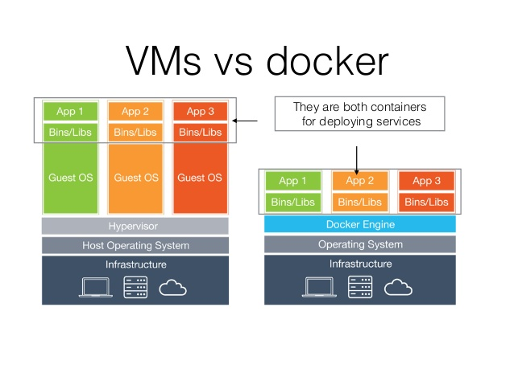

### Rapport de Stage

Le stage effectué les 2 derniers mois s'est déroulé au sein du Ministère de l'Intérieur, dans l'immeuble Lumière situé au cœur du 12ème arrondissement de Paris. Ce lieu, non loin de Bercy Village, est un endroit où il est agréable de se rendre chaque matin. L'édifice, composé de 8 étages et de 4 sous-sols, est un des plus grands immeubles de bureaux de Paris. Ses ascenseurs panoramiques aux allures futuristes et ses escalators de part et d'autre font rêver au 1er coup d’œil. 
  
A mon arrivée, j'ai retrouvé mon tuteur qui m'a tout d'abord montré mon bureau ainsi que mes nouveaux collègues. Comme vous pouvez le voir sur l'organigramme, je faisais parti du BCA, le Bureau de la Conception Applicative. 
Ce bureau s'occupe de la conception et de la réalisation des applications destinées au Ministère de l'Intérieur, ce dernier étant composé d'un personnel aux divers spécifications (Développeurs PHP, Python, Data Scientist, Architecte Informatique).  
  
 
  
  
Après avoir fait la connaissance des nombreuses personnes travaillant autour de moi, j'ai pu rejoindre mon lieu de travail pour installer le matériel. 

La prise en main de mon système d'exploitation commencée (Ubuntu 16.04 LTS), j'ai pu explorer cette nouvelle interface, apprendre les commandes de base du Terminale et effectuer l'installation des composants nécessaires pour mon travail. 

## Githug

A l'aide d'un tutoriel de mise en pratique des connaissances théoriques, appelé Githug et écrit en Ruby, j'ai approfondi mes connaissances concernant les commandes de Terminale de Git (git revert, git diff, git bisect etc.), et possède désormais de solides bases utiles tout au long de ma scolarité.

  
  

## Docker

Le premier outil sur lequel j'ai du travaillé s'intitule Docker. Il s'agit d'un logiciel libre permettant la mise en oeuvre de conteneurs s'exécutant en isolation, via une API de haut-niveau. Ce dernier utilise les fonctionnalités du noyau Linux et contrairement à une VM, il ne dispose pas de système d'exploitation. Le conteneur s'instancie grâce à une image Docker, regroupant un système de fichiers et un ensemble de paramètres. 

  
