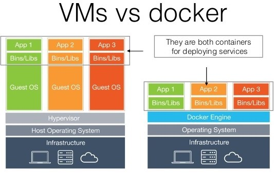

# Rapport de Stage - 02/06 au 11/08

Le stage effectué les deux derniers mois s'est déroulé au sein du Ministère de l'Intérieur, dans l'immeuble Lumière situé au cœur du douzième arrondissement de Paris. Ce lieu, non loin de Bercy Village, est un endroit où il est agréable de se rendre chaque matin. L'édifice, composé de huit étages et de quatre sous-sols, est un des plus grands immeubles de bureaux de Paris. Ses ascenseurs panoramiques aux allures futuristes et ses escalators de part et d'autre font rêver au premier coup d’œil. 
  
A mon arrivée, j'ai retrouvé mon tuteur qui m'a tout d'abord montré mon bureau ainsi que mes nouveaux collègues. Comme vous pouvez le voir sur l'organigramme, je faisais parti du BCA, le Bureau de la Conception Applicative, lui-même se trouvant dans la Sous-Direction des Applications. 

La SDA (Sous-direction des Applications) est en charge :
* du pilotage des projets applicatifs jusqu’à la vérification du service régulier (assistance à maîtrise d'ouvrage, étude et estimation des solutions techniques, conception, développement, tests et intégration)
* du pilotage des moyens opérationnels affectés aux projets (budget des projets, préparation et suivi des marchés)
* de la maintenance ''projet'' (corrective ou adaptative, évolutive en appliquant le processus projet)

Cette entité comprend environ cent trente agents, répartis en cinq bureaux :
* Bureau du Pilotage Applications (BPA)
* Bureau de la Conception Applicative (BCA)
* Bureau des Applications Métiers (BAM)
* Bureau des Applications Transverses (BAT)
* Bureau des Tests et de l'Intégration (BTI)

Le BCA (Bureau de la Conception Applicative) (relation client) est, au sein de la SDA, le bureau composé des métiers amont du cycle de vie du projet (l'assistance à la maîtrise d'ouvrage, la conception, l'architecture applicative, le développement, le support projet des bases de données, la gestion des référentiels et des composants).

Il compte environ trente personnes, réparties en trois sections : ''Assistance à maîtrise d'ouvrage'', ''Conception, Architecture, Référentiels'', ''Solutions et Développement''
  
 
  
  
  
Après avoir fait la connaissance des nombreuses personnes travaillant autour de moi, j'ai pu rejoindre mon lieu de travail pour installer le matériel. 

La prise en main de mon système d'exploitation commencée (Ubuntu 16.04 LTS), j'ai pu explorer cette nouvelle interface, apprendre les commandes de base du Terminale et effectuer l'installation des composants nécessaires pour mon travail. 

## Githug - 1ère semaine

  

A l'aide d'un tutoriel de mise en pratique des connaissances théoriques, appelé Githug et écrit en Ruby, j'ai approfondi mes connaissances concernant les commandes de Terminale de Git (git revert, git diff, git bisect etc.), et possède désormais de solides bases utiles tout au long de ma scolarité.
  
    
  

Git est un logiciel de gestion de versions décentralisé, permettant à plusieurs développeurs de travailler sur un même projet et d'avoir un suivi des modifications. Il est possible pour chaque utilisateur de développer sur son propre dépôt, de manière décentralisé, en évitant ainsi certains conflits entre les fichiers.

    

## Docker - 2ème et 3ème semaine 

  

Le premier outil sur lequel j'ai du travaillé s'intitule Docker. Il s'agit d'un logiciel libre permettant la mise en oeuvre de conteneurs s'exécutant en isolation, via une API de haut-niveau. Ce dernier utilise les fonctionnalités du noyau Linux et contrairement à une VM, il ne dispose pas de système d'exploitation. Le conteneur s'instancie grâce à une image Docker, regroupant un système de fichiers et un ensemble de paramètres. 

  
  
Un des avantages notables d'un conteneur Docker, en comparaison à une machine virtuelle, est son faible poids étant donné que ce dernier ne dispose pas d'OS, ce qui permet un lancement plus rapide et une migration facile. Aussi, il est possible de containériser une application, avec pour chaque couche des conteneurs isolant ses composants. Ce concept d'architecture de microservices est très utile du côté de la production.

  

L'utilisation de conteneurs s'opére grâce à un Terminale à l'aide de commandes diverses, même si ce dernier dispose dorénavant d'une interface graphique.
J'ai donc d'abord appris comment constuire un conteneur ainsi que tous les éléments nécessaires à son fonctionnement. Ensuite, j'ai réalisé un conteneur pour le développement de l'application que je devais réaliser.

## Symfony 3 - De la 4ème à la 7ème semaine

Il est le 2ème outil sur lequel il m'a été donné de travaillé. 

Symfony est à la fois un assemblage de composants PHP et un framework open source en PHP, développé par des informaticiens français de SensioLabs et à destinations d'autres développeurs.

Il permet de travailler de façon plus structurée et rigoureuse (aménagements structurants définis par le squelette de tout projet Symfony) et plus rapidement (réutilisation de modules). 
Il facilite aussi la maintenance à long terme et l'évolutivité en proposant dès la conception un ensemble de normes de développement. Il fournit un contexte de développement complet avec un outil de debug.

#### Arborescence

Son arborescence est ainsi organisé:
* Le dossier *app*    : configurations de l'application, traductions, templates etc
* Le dossier *bin*    : fichiers exécutables (ex: bin/console)
* Le dossier *src*    : code source de l'application, organisé en bundles
* Le dossier *var*    : fichiers générés (cache, logs, etc.)
* Le dossier *web*    : fichiers publics accessibles (css, js, images etc.)
* Le dossier *tests*  : liste des tests unitaires et fonctionnels
* Le dossier *vendor* : dépendances tiers de l'application

#### MVC

L'architecture de Symfony 3 respecte l'architecture MVC (Modèle - Vue - Contrôleur), qui permet de séparer les différentes parties du code d'une manière logique.

Le contrôleur gère la dynamique de l'application. Elle fait le lien entre l'utilisateur et le reste de l'application.
Le modèle encapsule la logique métier ainsi que l'accès aux données. Il peut s'agir d'un ensemble de fonctions (Modèle procédural) ou de classes (Modèle orienté objet).
La vue s'occupe des interactions avec l'utilisateur : présentation, saisie et validation des données.

Cette manière d'organiser le code permet une meilleure conception du logiciel et notamment un gain de temps dans sa maintenance. Cependant, cela implique trois fois plus de fichiers et une architecture plus complexe.

#### Bundles

Un bundle est une brique d’une application, un répertoire qui contient tout ce qui concerne une fonctionnalité donnée. Cela permet de bien organiser les différentes parties d’un site. 
Un des avantages de cette découpe en bundles est la possibilité de partager à la communauté les bundles réalisés, ou alors de les réutiliser dans une autre application, voir même d'utiliser des bundles développés par d'autres utilisateurs (des exemples connus tels que FOSUserBundle, FOSRestBundle etc).

Il s'organise d'une manière bien précise, avec un dossier Controller où l'on déposera nos contrôleurs avec la convention de nommage suivante: *nomcontroleurController*. On trouve aussi un dossier Entity où sont stockés tous nos modèles. Et enfin un dossier Resources est également présent, avec des sous-dossiers *config* (fichiers de configuration du bundle), *public* (fichiers js, css, img etc), *views* (vues de notre bundle).
  
  
   
Durant ces quatre semaines, il m'a tout d'abord été donné de suivre le tutoriel "Développez votre site web avec le framework Symfony" d'OpenClassroom afin de posséder toutes les bases et pouvoir débuter un nouveau projet. 
Après avoir étudié les nombreux concepts de Symfony 3, j'ai commencé la mise en place du projet en utilisant la console grâce à la commande "php symfony new nomduprojet". J'ai du générer un nouveau bundle afin de pouvoir créer l'essence de notre site puis installer les bundles développés par la communauté de Symfony, FOSUserBundle et FOSRestBundle, grâce à Composer. Composer est un gestionnaire de paquets écrit en PHP. Aussi, Bower, un outil de gestion des dépendances, m'a permis de disposer de certains outils indispensables (JQuery, Bootstrap etc.). Après avoir configurer Symfony et FOSUserBundle, je me suis attelé à la conception des vues du site, tout en devant passer outre les vues de base de FOSUser. Je me suis aussi occupé de la gestion des rôles des utilisateurs, à l'inscription, pour leur donner un rôle de base. J'ai réalisé également un tableau affiché seulement pour les utilisateurs disposant du rôle ROLE_ADMIN, afin que ce dernier puisse gérer facilement les utilisateurs inscrits. Pour étudier tous les aspects et le champ des possibilités de Symfony, j'ai suivi le tutoriel "Construisez une API REST avec Symfony", certaines notions m'échappant encore. 
A la fin de l'étude de ce framework, j'ai acquis un nombre de connaissances surprenantes me permettant désormais de réaliser des projets importants, tout en simplifiant mon travail de développeur. Une communauté active articulé tout autour de Symfony est une ressource utile. Dès lors qu'un problème se présente, on peut facilement trouver une solution grâce à ce soutien.
En résumé, Symfony 3 est un outil très utile dans le but de réaliser un gros projet, il permet de construire son code d'une manière précise et claire, et de bien l'organiser. De plus, son accessibilité en tant que framework open-source n'est pas non plus négligeable. Un temps d'apprentissage plutôt long et fastidieux est à prendre en compte, mais le résultat final est satisfaisant.

## Drupal 8 - De la 8ème à la 11ème semaine

Le dernier outil utilisé était Drupal 8, un CMS (Content Manager System) libre et open-source  permettant de gérer le contenu d'un site web simplement, sans passer par un développeur. Aujourd'hui, la 8ème version de Drupal facilite la tâche des développeurs en utilisant les bases de Symfony 2. Sa flexibilité lui permet de répondre à la très grande majorité des besoins du marché: blog, annuaire, site marchand ou intranets. La qualité du code et la robustesse de son interface de programmation (API), font que Drupal est également présenté comme un environnement de développement PHP (Framework). On parle alors de « Content Management Framework ».
On appelle modules les parties d'application permettant d'ajouter des fonctionnalités à ce CMS. Ainsi, il devient désormais facile pour un développeur d'écrire une nouvelle fonctionnalité à Drupal. Après avoir créer un dossier modules, il suffit de créer quelques fichiers de base (nommodule.routing.yml, nommodule.info.yml, src/Controller/NomController.php etc) pour avoir un rendu de notre module. De nombreux modules de base sont maintenant intégrés à Drupal, dès lors de l'installation, et ceux-ci sont activable ou désactivables grâce à l'interface du Super-Admin. De plus, un des points positifs de ce module est la facilité à les transposer vers un autre utilisateur, et ce sans besoin de développeur pour intégrer le module, l'installation se faisant automatiquement par l'interface administrateur de l'utilisateur.

#### Arborescence

Son arborescence est ainsi organisé:
* Le fichier *index.php*    : point d'entrée de Drupal
* Le dossier *core*         : répertoires et de fichiers nécessaires au fonctionnement de Drupal
* Le dossier *modules*      : modules contributeurs pour ajouter des fonctionnalités
* Le dossier *themes*       : thèmes additionels que l'on voudrait installer
* Le dossier *profiles*     : fichiers permettant une installation afin de transformer le site dans un but précis
* Le dossier *sites*        : fichiers publics du site (images, css, js etc.)

Les quatre dernières semaines ont donc été consacré à la découverte de Drupal et à la création d'un gestionnaire de tâches. Après avoir téléchargé ses composants, j'ai débuté la configuration du site qui est plutôt simple et guidé. J'ai par la suite écrit les premières lignes de code de mon module, et après quelques problèmes, j'ai réussi à afficher un aperçu de ma réalisation. Cependant, j'ai remarqué une absence de solutions lors de la confrontation à certains problèmes, peut-être dû à une communauté moins présente que celle de Symfony. Les tutoriels ne sont pas non plus présents en masse et freinent l'avancée du projet, à l'inverse de Symfony 3 où l'on était guidé notamment par OpenClassroom. Pour pouvoir créer une entité et les nombreux fichiers associés, j'ai du passer par la console Drupal qui, comme celle de Symfony, permet un gain de temps non négligeable. Cependant, malgré la rapidité d'exécution, on se retrouve avec de nombreux fichiers et ceux-ci utilisant d'autres documents du Core de Drupal, il devient vite difficile de personnaliser son module et de faire exactement ce que l'on souhaite. Après de nombreuses recherches, j'ai finalement réussi à sortir les éléments souhaités, mais de nombreux problèmes restaient encore à résoudre, notamment l'affichage des tâches selon l'utilisateur authentifié et celles qu'il a créées. 

